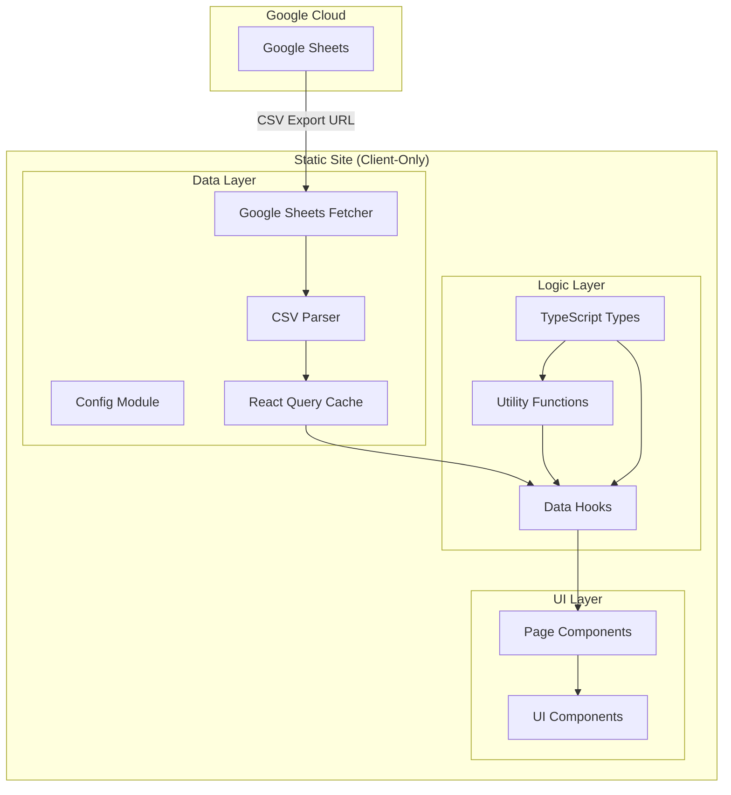
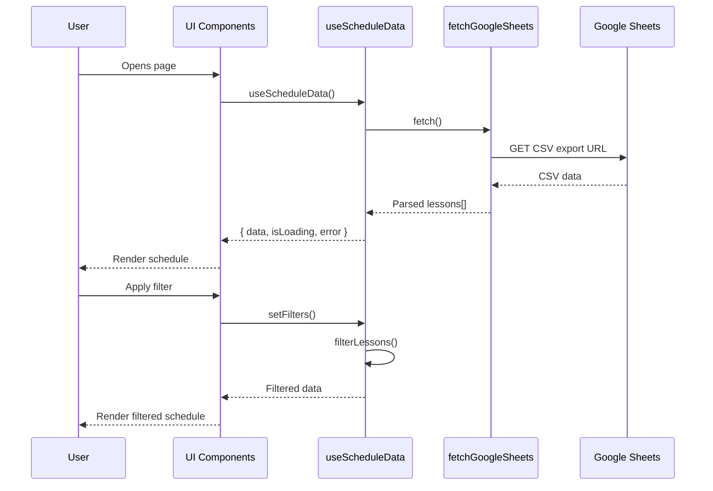

# Design Document: Static Site Migration

## Overview

Міграція системи управління розкладом Таврійського Коледжу з динамічного Express.js сервісу на статичний React сайт. Дані завантажуються з публічної Google Таблиці через CSV експорт. Архітектура побудована з чітким розділенням логіки даних та UI для легкої заміни дизайну.

## Architecture

### High-Level Architecture



### Data Flow



## Components and Interfaces

### Data Layer

#### Config Module (`lib/config.ts`)
```typescript
interface AppConfig {
  googleSheetsUrl: string;
  refreshInterval?: number; // optional auto-refresh in ms
}

function getConfig(): AppConfig;
function validateGoogleSheetsUrl(url: string): boolean;
```

#### Google Sheets Fetcher (`lib/google-sheets.ts`)
```typescript
interface FetchResult {
  data: string; // raw CSV
  fetchedAt: Date;
}

async function fetchGoogleSheetsCSV(url: string): Promise<FetchResult>;
```

#### CSV Parser (`lib/csv-parser.ts`)
```typescript
interface ParseResult {
  lessons: Lesson[];
  errors: ParseError[];
}

interface ParseError {
  row: number;
  message: string;
}

function parseScheduleCSV(csv: string): ParseResult;
```

### Logic Layer

#### Types (`types/schedule.ts`)
```typescript
interface Lesson {
  id: string;
  dayOfWeek: DayOfWeek;
  startTime: string;
  endTime: string;
  subject: string;
  teacher: string;
  group: string;
  classroom: string;
}

type DayOfWeek = 'Понедельник' | 'Вторник' | 'Среда' | 'Четверг' | 'Пятница' | 'Суббота';

interface ScheduleFilters {
  search?: string;
  group?: string;
  teacher?: string;
  classroom?: string;
}

interface FilterOptions {
  groups: string[];
  teachers: string[];
  classrooms: string[];
}

interface ScheduleStatistics {
  totalLessons: number;
  activeGroups: number;
  teachers: number;
  classrooms: number;
}

interface ScheduleState {
  lessons: Lesson[];
  filteredLessons: Lesson[];
  filters: ScheduleFilters;
  filterOptions: FilterOptions;
  statistics: ScheduleStatistics;
  isLoading: boolean;
  error: string | null;
  lastUpdated: Date | null;
}
```

#### Utility Functions (`lib/schedule-utils.ts`)
```typescript
function filterLessons(lessons: Lesson[], filters: ScheduleFilters): Lesson[];
function extractFilterOptions(lessons: Lesson[]): FilterOptions;
function calculateStatistics(lessons: Lesson[]): ScheduleStatistics;
function sortLessonsByDayAndTime(lessons: Lesson[]): Lesson[];
function generateLessonId(lesson: Omit<Lesson, 'id'>, index: number): string;
```

#### Data Hook (`hooks/useScheduleData.ts`)
```typescript
interface UseScheduleDataReturn {
  lessons: Lesson[];
  filteredLessons: Lesson[];
  filters: ScheduleFilters;
  setFilters: (filters: ScheduleFilters) => void;
  filterOptions: FilterOptions;
  statistics: ScheduleStatistics;
  isLoading: boolean;
  error: string | null;
  lastUpdated: Date | null;
  refresh: () => void;
  isRefreshing: boolean;
}

function useScheduleData(): UseScheduleDataReturn;
```

### UI Layer (Thin Presentation Components)

#### Page Component (`pages/schedule.tsx`)
- Receives all data from `useScheduleData` hook
- Composes UI components
- No business logic

#### UI Components (props-driven)
```typescript
// All components receive data through props, no internal data fetching

interface ScheduleGridProps {
  lessons: Lesson[];
  isLoading: boolean;
}

interface ScheduleFiltersProps {
  filters: ScheduleFilters;
  filterOptions: FilterOptions;
  onFiltersChange: (filters: ScheduleFilters) => void;
}

interface StatisticsDashboardProps {
  statistics: ScheduleStatistics;
  isLoading: boolean;
}

interface LoadingIndicatorProps {
  isLoading: boolean;
  lastUpdated: Date | null;
  onRefresh: () => void;
  isRefreshing: boolean;
}
```

## Data Models

### Lesson Schema
```typescript
const lessonSchema = z.object({
  dayOfWeek: z.enum(['Понедельник', 'Вторник', 'Среда', 'Четверг', 'Пятница', 'Суббота']),
  startTime: z.string().regex(/^\d{2}:\d{2}$/),
  endTime: z.string().regex(/^\d{2}:\d{2}$/),
  subject: z.string().min(1),
  teacher: z.string().min(1),
  group: z.string().min(1),
  classroom: z.string().min(1),
});
```

### Google Sheets CSV Format
Expected columns in Google Sheet:
| День недели | Время начала | Время окончания | Предмет | Преподаватель | Группа | Аудитория |
|-------------|--------------|-----------------|---------|---------------|--------|-----------|


## Correctness Properties

*A property is a characteristic or behavior that should hold true across all valid executions of a system-essentially, a formal statement about what the system should do. Properties serve as the bridge between human-readable specifications and machine-verifiable correctness guarantees.*

Based on the prework analysis, the following properties consolidate related acceptance criteria to avoid redundancy:

### Property 1: CSV Parsing Round Trip
*For any* valid array of lessons, serializing to CSV format and then parsing back should produce an equivalent array of lessons (with the same data, though IDs may differ).
**Validates: Requirements 1.2**

### Property 2: Invalid Row Filtering
*For any* CSV string containing a mix of valid and invalid rows, parsing should return only lessons from valid rows, and the count of returned lessons plus the count of parse errors should equal the total row count.
**Validates: Requirements 1.3, 1.5**

### Property 3: Filter Options Uniqueness
*For any* array of lessons, extracting filter options should return arrays where each value appears exactly once (no duplicates in groups, teachers, or classrooms arrays).
**Validates: Requirements 2.1**

### Property 4: Filter Correctness
*For any* array of lessons and any combination of filters (group, teacher, classroom, search), all returned lessons must satisfy ALL applied filter conditions simultaneously.
**Validates: Requirements 2.2, 2.3, 2.4, 2.5**

### Property 5: Statistics Invariants
*For any* array of lessons, the calculated statistics must satisfy:
- totalLessons equals lessons.length
- activeGroups equals the count of unique group values
- teachers equals the count of unique teacher values  
- classrooms equals the count of unique classroom values
**Validates: Requirements 3.1, 3.2, 3.3, 3.4**

### Property 6: Google Sheets URL Validation
*For any* string input, the URL validator should return true only for strings that match the Google Sheets public CSV export URL pattern.
**Validates: Requirements 5.3**

### Property 7: Utility Function Purity
*For any* input to filterLessons, extractFilterOptions, calculateStatistics, or sortLessonsByDayAndTime, calling the function twice with the same input should produce identical output (idempotence).
**Validates: Requirements 8.2**

### Property 8: Sort Order Consistency
*For any* array of lessons, sorting by day and time should produce a result where each lesson appears before any lesson that occurs later in the week or later in the same day.
**Validates: Requirements 2.2 (implicit ordering requirement)**

## Error Handling

### Network Errors
- Display user-friendly error message in Ukrainian
- Implement retry with exponential backoff (initial 5s, max 30s)
- Show "Спробувати знову" button for manual retry

### Parse Errors
- Log invalid rows to console for debugging
- Continue processing valid rows
- Display warning if >10% of rows are invalid

### Configuration Errors
- Check for Google Sheets URL on app initialization
- Display clear error message if URL is missing or invalid
- Prevent app from attempting to fetch without valid config

### Validation Errors
- Use Zod for schema validation
- Collect all validation errors per row
- Skip invalid rows, don't fail entire parse

## Testing Strategy

### Property-Based Testing Library
**fast-check** - JavaScript/TypeScript property-based testing library

Configuration:
- Minimum 100 iterations per property test
- Use `fc.assert` with `{ numRuns: 100 }` option

### Test File Structure
```
client/src/
├── lib/
│   ├── __tests__/
│   │   ├── csv-parser.test.ts      # Property tests for parsing
│   │   ├── schedule-utils.test.ts  # Property tests for utilities
│   │   └── config.test.ts          # URL validation tests
│   ├── csv-parser.ts
│   ├── schedule-utils.ts
│   └── config.ts
```

### Property-Based Tests

Each property test must be tagged with:
```typescript
// **Feature: static-site-migration, Property {number}: {property_text}**
```

#### CSV Parser Tests (`csv-parser.test.ts`)
- Property 1: Round trip (generate lessons → CSV → parse → compare)
- Property 2: Invalid row filtering (generate mixed CSV → verify counts)

#### Schedule Utils Tests (`schedule-utils.test.ts`)
- Property 3: Filter options uniqueness
- Property 4: Filter correctness
- Property 5: Statistics invariants
- Property 7: Utility function purity
- Property 8: Sort order consistency

#### Config Tests (`config.test.ts`)
- Property 6: URL validation

### Unit Tests

Unit tests complement property tests for specific examples:
- Edge cases: empty arrays, single item arrays
- Known problematic inputs from real data
- Error message content verification

### Test Generators

Custom generators for property tests:
```typescript
// Lesson generator
const lessonArb = fc.record({
  dayOfWeek: fc.constantFrom('Понедельник', 'Вторник', 'Среда', 'Четверг', 'Пятница', 'Суббота'),
  startTime: fc.stringMatching(/^([01]\d|2[0-3]):[0-5]\d$/),
  endTime: fc.stringMatching(/^([01]\d|2[0-3]):[0-5]\d$/),
  subject: fc.string({ minLength: 1, maxLength: 100 }),
  teacher: fc.string({ minLength: 1, maxLength: 100 }),
  group: fc.stringMatching(/^[А-ЯІЄЇ]+-\d+$/),
  classroom: fc.string({ minLength: 1, maxLength: 20 }),
});

// Lessons array generator
const lessonsArb = fc.array(lessonArb, { minLength: 0, maxLength: 100 });

// Filters generator
const filtersArb = fc.record({
  search: fc.option(fc.string(), { nil: undefined }),
  group: fc.option(fc.string(), { nil: undefined }),
  teacher: fc.option(fc.string(), { nil: undefined }),
  classroom: fc.option(fc.string(), { nil: undefined }),
});
```

